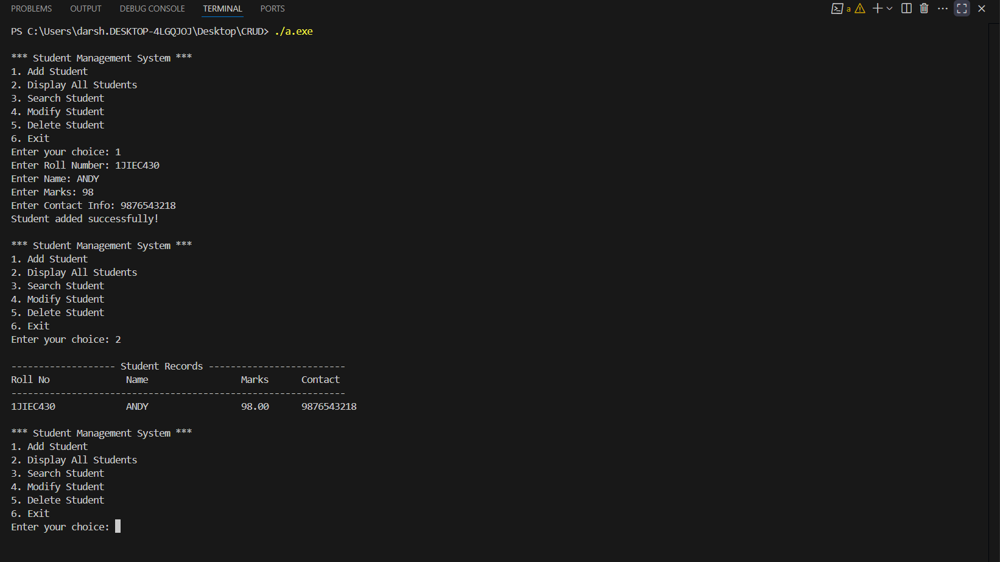

# Student Management System in C

A simple **Student Management System** written in C that allows adding, viewing, searching, modifying, and deleting student records.  
Data is stored in a file for persistence between program runs.

## Features
- Add new student details
- Display all student records
- Search for a student by roll number
- Modify student details
- Delete student records
- Save data to file

## How to Run
1. Clone the repository:
   ```bash
   git clone https://github.com/Darshan0IV/student-management-system.git
## Output


